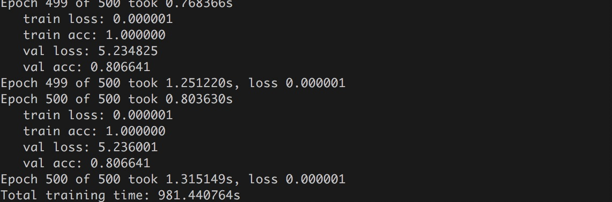

# robotics_recognition
Robotics Multimodal Deep Learning for Object Recognition

Applying CNN in to RGB-D dataset for fast and accurate object recognition 
Num of classes = 15
Used Libraries Tenforflow and Tensorlayer

Input Image size = (32,32)  self.image_shape = (32,32)
No. of layers = 3
Inputs {X : RGB, X_depth: Depth Image

All layers are designed with tensorlayer and backend with tensorflow

        base = tf.constant_initializer(value=0.1)
        Weight = tf.truncated_normal_initializer(stddev=0.04)

  

Network architecture I designed two independent network layers for each and RGB and Depth Images 
        networkRGB = tl.layers.InputLayer(x, name='input_layerRGB')
        networkDepth = tl.layers.InputLayer(x_depth, name='input_layerDepth') 

for RGB the convolution layer is shaped with 3,3,3,64 indeed the network input structure is same as input size of the pictures which means 32 by 32 so the place holder is designed in the same way with inputs and outputs

    x = tf.placeholder(tf.float32, shape=[None, 32,32,3], name='x')
    x_depth = tf.placeholder(tf.float32, shape=[None,32,32,1], name='x_depth')
    y_ = tf.placeholder(tf.int64, shape=[None], name='y_')  

Here because we have 3 colors for RGB and 1 channel for depth (x and x_depth) and our output y_ is undefined because it will store for both RGB and Depth one. 

Reference:

1.	http://tensorlayer.readthedocs.io/en/stable/modules/layers.html
2.	https://arxiv.org/pdf/1507.06821.pdf
3.	https://www.tensorflow.org/tutorials/estimators/cnn
4.	https://www.tensorflow.org/api_docs/python/tf/layers/dropout

